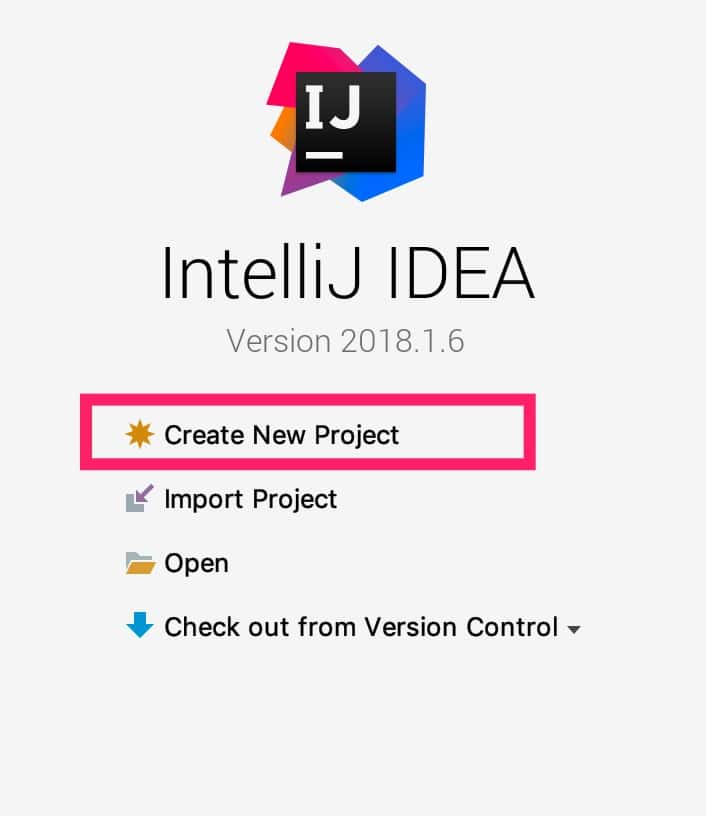
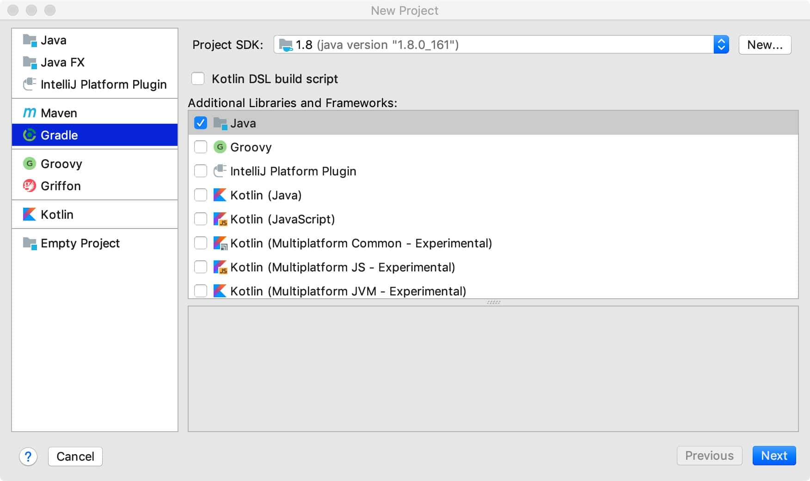
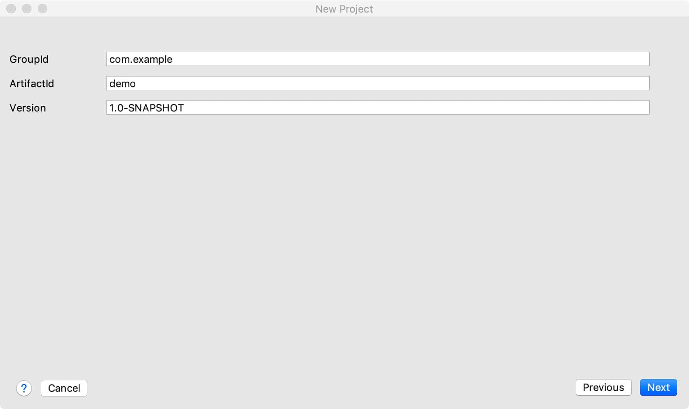
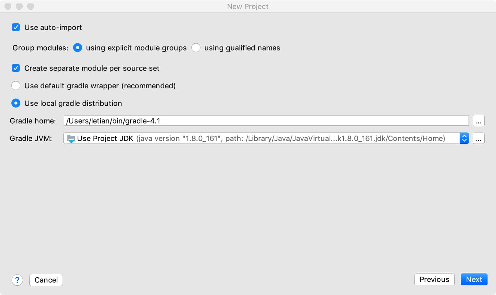
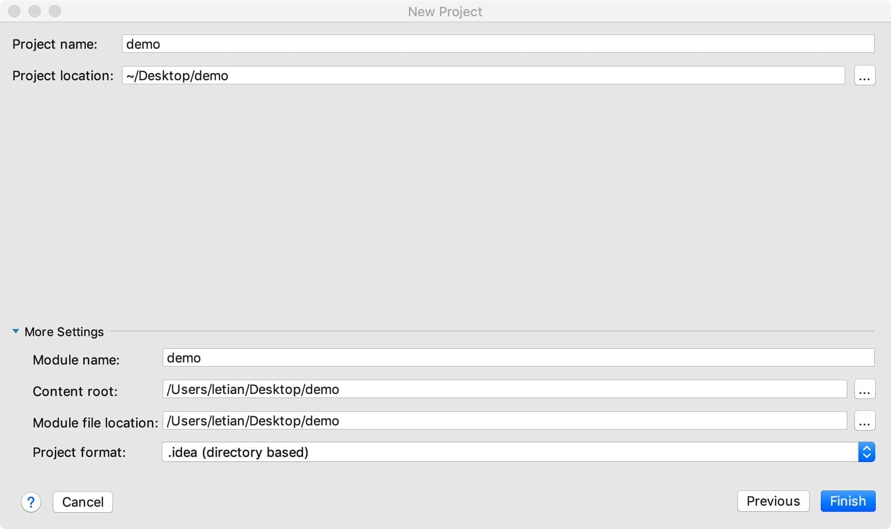
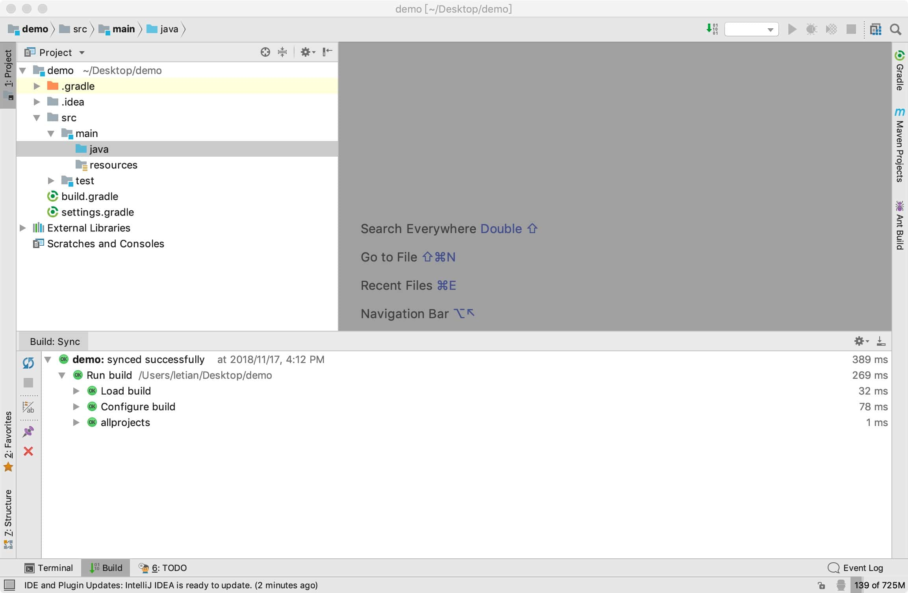
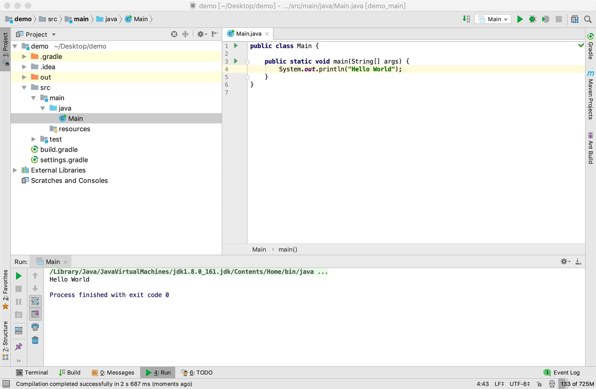

# 03. 使用 Intellij IDEA 创建 Java 项目

## 创建基于 Gradle 的 Java 项目
打开 Intellij IDEA, 选择创建新项目：



> 也可以选择从菜单栏 File -> New -> Project... 创建项目。

选择 Gralde Java：



点击 Next 进入下一步，填写 GroupId、ArtifactId：



点击 Next 进入下一步，指定本地gradle的位置：



点击 Next 进入下一步，指定项目位置，我们将其放在 ~/Desktop/demo 目录中：


点击 Finish 。完成项目创建，IDE 进入项目编辑界面：



在 `src/main/java` 目录下创建Main类，将其内容修改如下：

```java
public class Main {

    public static void main(String[] args) {
        System.out.println("Hello World");
    }
}
```

右击，选择'Run Main.main()' ，运行结果如下：




## 打开基于 Gradle 的 Java 项目

创建项目后，该项目会自动放入 IDE 的历史记录中，如果当前未打开该项目，可以从 File -> Open Recent 找到它，点击打开即可。但是历史记录是有数量限制的，如果不曾打开过一个项目，或者历史记录中已经没有该项目了，便需要用最基础的方法：File -> Open -> 选择build.gralde文件 -> Open As Project 即可。


> 留一个问题：
> gradle wrapper 是什么？