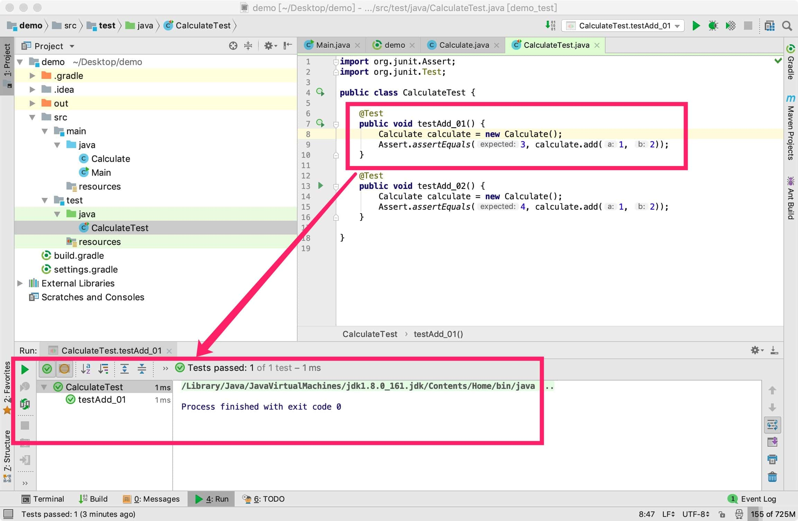
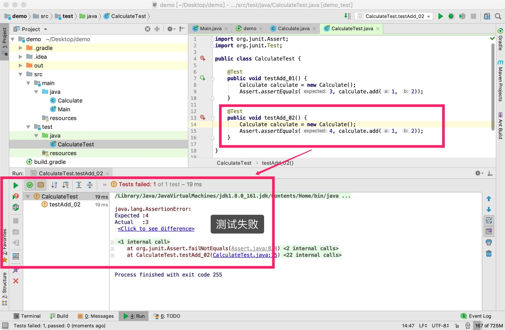
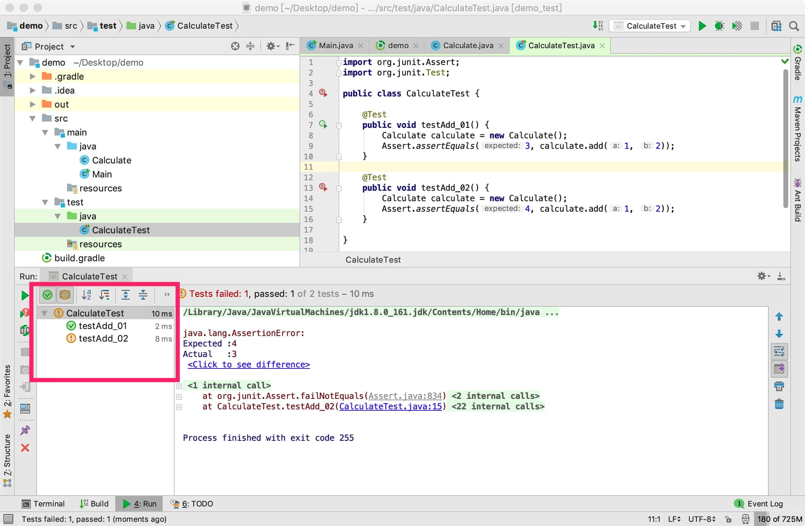

# 04. JUnit 的使用


JUnit 是一个测试框架，经常被拿来做单元测试。单元测试的粒度一般是方法。


我们看下如何编写单元测试。


在[03-使用Intellij-IDEA创建Java项目.md](./03-使用Intellij-IDEA创建Java项目.md)中我们创建了一个机遇gradle的java项目，其中 build.gradle 的默认内容如下：

```plain
plugins {
    id 'java'
}

group 'com.example'
version '1.0-SNAPSHOT'

sourceCompatibility = 1.8

repositories {
    mavenCentral()
}

dependencies {
    testCompile group: 'junit', name: 'junit', version: '4.12'
}

```


可以看到在 dependencies 中引入了junit依赖：

```
testCompile group: 'junit', name: 'junit', version: '4.12'
```

`testCompile`声明的依赖，只有在进行测试时才有效。又或者说，只有在`src/test`目录下的代码才会感知到 junit 依赖。

在 `src/main/java`中创建 Calculate 类，内容如下：

```java
public class Calculate {

    public int add(int a, int b) {
        return a+b;
    }

}
```

在`src/test/java`中创建 CalculateTest 类，内容如下：

```java
import org.junit.Assert;
import org.junit.Test;

public class CalculateTest {

    @Test
    public void testAdd_01() {
        Calculate calculate = new Calculate();
        Assert.assertEquals(3, calculate.add(1, 2));
    }

    @Test
    public void testAdd_02() {
        Calculate calculate = new Calculate();
        Assert.assertEquals(4, calculate.add(1, 2));
    }

}
```


在 testAdd_01 函数内部，鼠标右击，选择「Run testAdd_01」，会看到测试成功：



在 testAdd_02 函数内部，鼠标右击，选择「Run testAdd_02」，会看到测试失败：




在 testAdd_01 和 testAdd_02 函数外，鼠标右击，选择「Run CalculateTest」，会看到 testAdd_01 和 testAdd_02 都执行了：





留几个问题：

> 如果要执行`src/test`目录下的所有测试代码，怎么做？
>
> 如何查看测试覆盖率？ 
>
> 如果将 build.gradle 中的 `testCompile` 改成`compile`，那么能在`src/main`目录写测试代码吗？