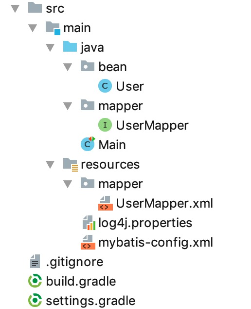

# 02. 查找id为1的用户信息

## 1. 数据准备

见 [01. 数据准备](01-数据准备.md)

## 2. 示例1

使用 IDEA 创建 gradle 项目，最终结构如下：



### 2.1 添加依赖

在 build.gradle 中添加以下依赖：

```gradle
compile group: 'org.mybatis', name: 'mybatis', version: '3.4.6'
compile group: 'mysql', name: 'mysql-connector-java', version: '5.1.6'

compile group: 'org.projectlombok', name: 'lombok', version: '1.18.0'

compile group: 'org.slf4j', name: 'slf4j-api', version: '1.7.25'
compile group: 'org.slf4j', name: 'slf4j-log4j12', version: '1.7.25'
compile group: 'log4j', name: 'log4j', version: '1.2.17'

compile group: 'junit', name: 'junit', version: '4.12'
```

### 2.2 配置log4j

在 resources 目录下增加文件 `log4j.properties`，内容如下：

```ini
log4j.rootLogger=INFO, stdout
log4j.appender.stdout=org.apache.log4j.ConsoleAppender
log4j.appender.stdout.layout=org.apache.log4j.PatternLayout
log4j.appender.stdout.layout.ConversionPattern=%5p [%t] - %m%n
```

### 2.3 增加 user 表对应的类 User

在 java 目录下创建bean包，然后添加 User 类，内容如下：

```java
package bean;

import lombok.Data;

@Data
public class User {

    private Long id;
    private String name;
    private String email;
    private String password;

}
```

这个类中的字段和 user 表中的列是一一对应的。


### 2.4 mybatis 配置

在`resources`目录下增加`mybatis-config.xml`，内容如下：

```xml
<?xml version="1.0" encoding="UTF-8" ?>
<!DOCTYPE configuration
        PUBLIC "-//mybatis.org//DTD Config 3.0//EN"
        "http://mybatis.org/dtd/mybatis-3-config.dtd">
<configuration>
    <environments default="development">
        <environment id="development">
            <transactionManager type="JDBC"/>
            <dataSource type="POOLED">
                <property name="driver" value="com.mysql.jdbc.Driver"/>
                <property name="url" value="jdbc:mysql://127.0.0.1:3306/blog_db?useUnicode=true&amp;characterEncoding=utf8"/>
                <property name="username" value="root"/>
                <property name="password" value="123456"/>
            </dataSource>
        </environment>
    </environments>
    <mappers>
        <mapper resource="mapper/UserMapper.xml"/>
    </mappers>
</configuration>
```

`environments`下可以配置多个`environment`（即环境，如开发环境、生产环境等），`environments`的`default`属性指定默认用哪个环境。

`environment`中可以配置事务管理器、数据库地址、用户、密码等。

`mappers`与`environments`平级，指定 XML 映射文件的位置。

`mapper/UserMapper.xml`在哪里呢？在`resources`目录下，下面会讲到。


### 2.5 定义映射接口

在 `java/mapper`下创建 UserMapper 接口，代码如下：

```java
package mapper;

import bean.User;

public interface UserMapper {

    /**
     * 根据id获取用户信息
     * @param id
     * @return
     */
    User findById(Long id);

}
```

UserMapper 接口中的方法`findById`能下面的 XML 映射文件中的内容与`resource/mapper/UserMapper.xml`中的配置对应起来的。

### 2.6 编写 XML 映射文件

在 `resource/mapper`下创建 `UserMapper.xml`，内容如下：

```xml
<?xml version="1.0" encoding="UTF-8" ?>
<!DOCTYPE mapper PUBLIC
        "-//mybatis.org//DTD Mapper 3.0//EN"
        "http://mybatis.org/dtd/mybatis-3-mapper.dtd">

<mapper namespace="mapper.UserMapper">
    <!-- findById必须和接口中的方法名一样 -->
    <select id="findById" parameterType="java.lang.Long" resultType="bean.User">
        select * from blog_db.user where id=#{id}
    </select>
</mapper>
```

`<mapper>`标签的`namesapce`指定了对应的类，也就是2.5中定义的 UserMapper 接口。

`<select>`的id是`findById`，对应UserMapper接口的findById方法。`parameterType`指明了findById的参数类型，不过这个属性是可以省略的。`<select>`中是一个select语句，其中`#{id}`对应方法`findById`的参数`Long id`，执行select查询后，返回的类型是`bean.User`。


在这里留几个问题：

1. 如果函数有多个参数，parameterType 该怎么写？
2. `#{id}`如果换成`#{hello}`是否有效？


### 2.7 最后一步

以上，我们把该准备的都做好了，现在开始写「业务逻辑」。创建 Main 类，内容如下：

```java
import java.io.IOException;

import lombok.extern.slf4j.Slf4j;
import org.apache.ibatis.io.Resources;
import org.apache.ibatis.session.SqlSession;
import org.apache.ibatis.session.SqlSessionFactory;
import org.apache.ibatis.session.SqlSessionFactoryBuilder;

import bean.User;
import mapper.UserMapper;
import org.junit.Test;


@Slf4j
public class Main {

    @Test
    public void test_01() throws IOException {
        SqlSessionFactoryBuilder sqlSessionFactoryBuilder = new SqlSessionFactoryBuilder();
        SqlSessionFactory sessionFactory;

        sessionFactory = sqlSessionFactoryBuilder.build(
                Resources.getResourceAsReader("mybatis-config.xml"),
                "development"  // 这个参数可以省略，因为 mybatis-config.xml 的<environments>标签指定了默认环境为development
        );

        SqlSession sqlSession = sessionFactory.openSession();

        // 以上是样板代码
        // 以下是「业务逻辑」

        UserMapper userMapper = sqlSession.getMapper(UserMapper.class);
        User user = userMapper.findById(1L);
        log.info("{}", user);
    }

}
```


执行结果如下：

```plain
 INFO [main] - User(id=1, name=letian, email=letian@111.com, password=123)
```


和预期一样！😆