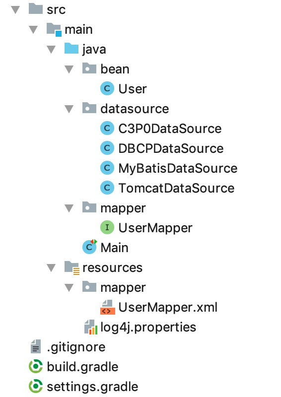

# 04. 如果不用 MyBatis 配置文件

本示例代码在 [mybatis-demo-003](../../demo/mybatis-demo-003) 。

前面的示例中用到了 `mybatis-config.xml`、`mybatis-config-dbcp.xml` 这种配置文件。可以不用吗？

可以不用，我们见下面的示例。

项目结构：



## 示例

在 datasource 包中创建 MyBatisDataSource 类，该类用于获取连接池，内容如下：
```java
package datasource;

import org.apache.ibatis.datasource.pooled.PooledDataSource;

import javax.sql.DataSource;

public class MyBatisDataSource {

    public static DataSource get() {
        PooledDataSource dataSource = new PooledDataSource();
        dataSource.setUsername("root");
        dataSource.setPassword("123456");
        dataSource.setUrl("jdbc:mysql://127.0.0.1:3306/blog_db?useUnicode=true&characterEncoding=utf8");
        dataSource.setDriver("com.mysql.jdbc.Driver");
        dataSource.setPoolMaximumActiveConnections(100);
        dataSource.setPoolMaximumIdleConnections(8);
        return dataSource;
    }

}
```

在 Main 类中编写业务代码：
```java
@Test
public void test_01() {
    DataSource dataSource = MyBatisDataSource.get();
    TransactionFactory transactionFactory = new JdbcTransactionFactory();
    Environment environment = new Environment("development", transactionFactory, dataSource);
    Configuration configuration = new Configuration(environment);
    configuration.addMapper(UserMapper.class);
    SqlSessionFactory sessionFactory = new SqlSessionFactoryBuilder().build(configuration);

    SqlSession sqlSession = sessionFactory.openSession();
    try {
        UserMapper userMapper = sqlSession.getMapper(UserMapper.class);
        User user = userMapper.findById(1L);
        log.info("{}", user);
    } finally {
        sqlSession.close();
    }
}
```
很简单，就是将 xml 配置用代码表达了一遍。

注意，UserMapper.xml 映射文件所在目录必须和对应的 UserMapper 接口在相同位置的目录下，且要同名。 比如 UserMapper 接口在 `java` 目录的 `mapper` 包下，UserMapper.xml 就必须在 `resources` 目录下的`mapper` 目录下。

执行后输出：
```plain
 INFO [main] - User(id=1, name=letian, email=letian@111.com, password=123)
```

## 其他连接池

上面我们用到了 MyBatis 自带的连接池。我们也可以用其他的连接池。例如：

**DBCP连接池：**

build.gradle 引入依赖：
```
compile group: 'org.apache.commons', name: 'commons-dbcp2', version: '2.5.0'
```
datasource 包下新增 DBCPDataSource 类：
```java
package datasource;

import org.apache.commons.dbcp2.BasicDataSource;

import javax.sql.DataSource;

public class DBCPDataSource {

    public static DataSource get() {
        BasicDataSource dataSource = new BasicDataSource();
        dataSource.setUsername("root");
        dataSource.setPassword("123456");
        dataSource.setUrl("jdbc:mysql://127.0.0.1:3306/blog_db?useUnicode=true&characterEncoding=utf8");
        dataSource.setDriverClassName("com.mysql.jdbc.Driver");
        dataSource.setInitialSize(6);
        dataSource.setMaxIdle(8);
        dataSource.setMinIdle(6);
        return dataSource;
    }

}
```
编写测试代码：
```java
@Test
public void test_02() {
    DataSource dataSource = DBCPDataSource.get();
    TransactionFactory transactionFactory = new JdbcTransactionFactory();
    Environment environment = new Environment("development", transactionFactory, dataSource);
    Configuration configuration = new Configuration(environment);
    configuration.addMapper(UserMapper.class);
    SqlSessionFactory sessionFactory = new SqlSessionFactoryBuilder().build(configuration);

    SqlSession sqlSession = sessionFactory.openSession();
    try {
        UserMapper userMapper = sqlSession.getMapper(UserMapper.class);
        User user = userMapper.findById(1L);
        log.info("{}", user);
    } finally {
        sqlSession.close();
    }
}
```

**C3P0连接池：**

build.gradle 引入依赖：
```
compile group: 'com.mchange', name: 'c3p0', version: '0.9.5.2'
```
datasource 包下新增 C3P0DataSource 类：
```java
package datasource;

import com.mchange.v2.c3p0.ComboPooledDataSource;

import javax.sql.DataSource;
import java.beans.PropertyVetoException;

public class C3P0DataSource {

    public static DataSource get() throws PropertyVetoException {
        ComboPooledDataSource dataSource = new ComboPooledDataSource();
        dataSource.setUser("root");
        dataSource.setPassword("123456");
        dataSource.setJdbcUrl("jdbc:mysql://127.0.0.1:3306/blog_db?useUnicode=true&characterEncoding=utf8");
        dataSource.setDriverClass("com.mysql.jdbc.Driver");
        dataSource.setInitialPoolSize(6);
        dataSource.setMaxPoolSize(100);
        return dataSource;
    }
}
```

**Tomcat JDBC 连接池：**

build.gradle 引入依赖：
```
compile group: 'org.apache.tomcat', name: 'tomcat-jdbc', version: '9.0.12'
```
datasource 包下新增 C3P0DataSource 类：
```java
package datasource;

import org.apache.commons.dbcp2.BasicDataSource;

import javax.sql.DataSource;

public class TomcatDataSource {

    public static DataSource get() {
        org.apache.tomcat.jdbc.pool.DataSource dataSource = new org.apache.tomcat.jdbc.pool.DataSource();
        dataSource.setUsername("root");
        dataSource.setPassword("123456");
        dataSource.setUrl("jdbc:mysql://127.0.0.1:3306/blog_db?useUnicode=true&characterEncoding=utf8");
        dataSource.setDriverClassName("com.mysql.jdbc.Driver");
        dataSource.setInitialSize(6);
        dataSource.setMaxIdle(8);
        dataSource.setMinIdle(6);
        return dataSource;
    }

}
```