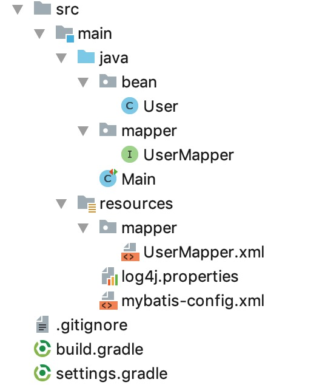

# 08. 排序

本节示例代码在 [mybatis-demo-007](../../demo/mybatis-demo-007) 。


## 数据准备
见 [01. 数据准备](01-数据准备.md)。

## 项目结构



## UserMapper 接口

内容如下：

```java
package mapper;

import bean.User;
import org.apache.ibatis.annotations.Param;

import java.util.List;

public interface UserMapper {

    /**
     * 根据密码查询所有用户
     * @param password
     * @return
     */
    List<User> findByPassword(@Param("password") String password, @Param("orderClause") String orderClause);

}
```

findByPassword 函数的第2参数用于排序。


### UserMapper.xml 映射

```xml
<?xml version="1.0" encoding="UTF-8" ?>
<!DOCTYPE mapper PUBLIC
        "-//mybatis.org//DTD Mapper 3.0//EN"
        "http://mybatis.org/dtd/mybatis-3-mapper.dtd">

<mapper namespace="mapper.UserMapper">

    <select id="findByPassword" resultType="bean.User">
        select
        * from blog_db.user where password=#{password} order by ${orderClause}
    </select>

</mapper>
```

为什么 password 用 `#{}` 包含，而orderClause 用`${}`  ?

简单来说， `#{}`用来表示数据，`${}`用来填充SQL。因为  `#{}` 会导致 MyBatis 创建 `PreparedStatement` 参数并安全地设置参数，而`${}`是简单的替换。


### 运行

我们在 Main 类中写两个示例：

```java
import java.io.IOException;
import java.util.Iterator;
import java.util.List;

import lombok.extern.slf4j.Slf4j;
import org.apache.ibatis.io.Resources;
import org.apache.ibatis.session.SqlSession;
import org.apache.ibatis.session.SqlSessionFactory;
import org.apache.ibatis.session.SqlSessionFactoryBuilder;

import bean.User;
import mapper.UserMapper;
import org.junit.Test;


@Slf4j
public class Main {

    @Test
    public void test_01() throws IOException {
        SqlSession sqlSession = getSqlSession();
        UserMapper userMapper = sqlSession.getMapper(UserMapper.class);
        List<User> userList = userMapper.findByPassword("123", "id asc");
        log.info("{}", userList);
    }

    @Test
    public void test_02() throws IOException {
        SqlSession sqlSession = getSqlSession();
        UserMapper userMapper = sqlSession.getMapper(UserMapper.class);
        List<User> userList = userMapper.findByPassword("123", "id desc");
        log.info("{}", userList);
    }

    private SqlSession getSqlSession() throws IOException {
        SqlSessionFactory sessionFactory;
        sessionFactory = new SqlSessionFactoryBuilder()
                .build(Resources.getResourceAsReader("mybatis-config.xml"));
        return sessionFactory.openSession();
    }

}
```


test_01 示例是查询密码为 123 的所有用户，并按照**id升序**返回结果。运行结果如下：

```
 INFO [main] - [User(id=1, name=letian, email=letian@111.com, password=123), User(id=2, name=xiaosi, email=xiaosi@111.com, password=123)]
```

test_02 示例是查询密码为 123 的所有用户，并按照**id降序**返回结果。运行结果如下：

```
 INFO [main] - [User(id=2, name=xiaosi, email=xiaosi@111.com, password=123), User(id=1, name=letian, email=letian@111.com, password=123)]
```

