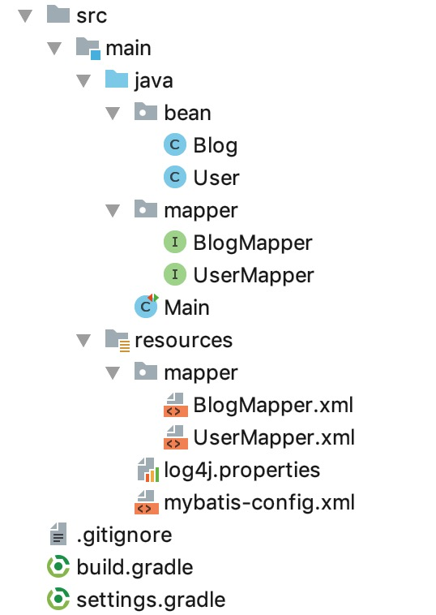
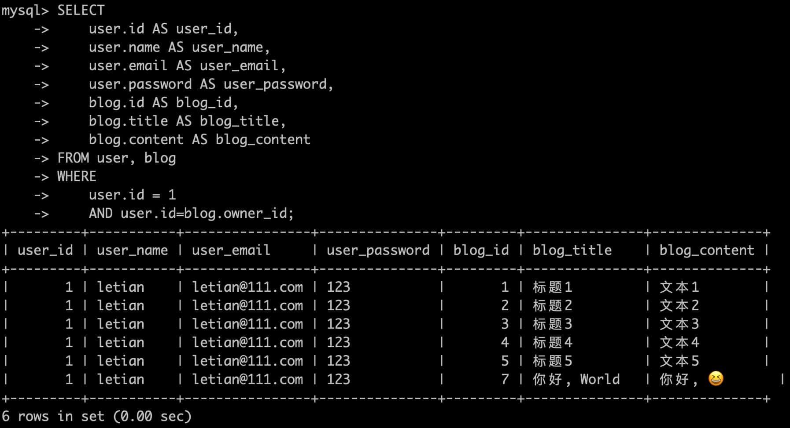

本节示例代码在 [mybatis-demo-012](../../demo/mybatis-demo-012) 。


## 数据准备

见 [01. 数据准备](01-数据准备.md)。

user表和blog表的默认内容如下：

```plain
mysql> select * from user;
+----+--------+----------------+----------+
| id | name   | email          | password |
+----+--------+----------------+----------+
|  1 | letian | letian@111.com | 123      |
|  2 | xiaosi | xiaosi@111.com | 123      |
+----+--------+----------------+----------+

mysql> select * from blog;
+----+----------+---------------+--------------+
| id | owner_id | title         | content      |
+----+----------+---------------+--------------+
|  1 |        1 | 标题1         | 文本1        |
|  2 |        1 | 标题2         | 文本2        |
|  3 |        1 | 标题3         | 文本3        |
|  4 |        1 | 标题4         | 文本4        |
|  5 |        1 | 标题5         | 文本5        |
|  6 |        2 | 标题21        | 文本21       |
|  7 |        1 | 你好, World   | 你好, 😆       |
+----+----------+---------------+--------------+
```


## 项目结构

使用 IDEA 创建 gradle 项目，最终结构如下：



## 新的 User、Blog 类


在 User 类中新增字段

```java
package bean;

import lombok.Data;

import java.util.List;

@Data
public class User {

    private Long id;
    private String name;
    private String email;
    private String password;
    private List<Blog> blogs; // 属于该用户的博客

}

```

用户和博客是一对多的关心，所以增加了`List<Blog> blogs`变量。


在本节示例中会新引入有引入blog 表，对应的 bean 定义：

```java
package bean;

import lombok.Data;

@Data
public class Blog {

    private Long id;
    private Long ownerId;  // 博客作者的用户id
    private String title;
    private String content;
    private User user;  // 博客作者信息
    
}
```

博客和用户是一对一的关系，所以增加了`User user`变量。

## 让mybatis输出执行流程

配置 log4j.properties 内容为：
```ini
log4j.rootLogger=DEBUG, stdout
log4j.appender.stdout=org.apache.log4j.ConsoleAppender
log4j.appender.stdout.layout=org.apache.log4j.PatternLayout
log4j.appender.stdout.layout.ConversionPattern=%5p [%t] - %m%n

# mapper 包下的所有接口的方法都会打日志，会打印不低于 DEBUG 级别的日志
log4j.logger.org.mybatis.mapper=TRACE
```

如此，mapper 包下的所有接口的方法都会打日志，会打印不低于 DEBUG 级别的日志。而DEBUG 是日志的最低级别，所以这种配置我们能看到mybatis的运行流程。


## 根据 id 获取用户及其博客信息

在 UserMapper 中增加方法：
```java
User findById(Long id);
```

在 UserMapper.xml 增加以下内容：
```xml
<resultMap id="userResult" type="bean.User">

    <result property="id" column="user_id"/>
    <result property="name" column="user_name"/>
    <result property="email" column="user_email"/>
    <result property="password" column="user_password"/>

    <collection property="blogs" ofType="bean.Blog">
        <id property="id" column="blog_id"/>
        <result property="ownerId" column="user_id"/>
        <result property="title" column="blog_title"/>
        <result property="content" column="blog_content"/>
    </collection>

</resultMap>

<select id="findById" parameterType="Long" resultMap="userResult" resultType="bean.User">
    SELECT
        user.id AS user_id,
        user.name AS user_name,
        user.email AS user_email,
        user.password AS user_password,
        blog.id AS blog_id,
        blog.title AS blog_title,
        blog.content AS blog_content
    FROM user, blog 
    WHERE 
        user.id = #{id} 
        AND user.id=blog.owner_id;
</select>
```

`<select id="findById"></select>`中的sql语句的作用是根据给出的用户id得到用户的信息以及该用户所有的blog，所以SQL 执行结果中，若有多条记录，那么 `user_id`、`user_name`、`user_email`、`user_password`的值是一样的。而Blog信息会 不一样。例如执行：

```sql
SELECT
    user.id AS user_id,
    user.name AS user_name,
    user.email AS user_email,
    user.password AS user_password,
    blog.id AS blog_id,
    blog.title AS blog_title,
    blog.content AS blog_content
FROM user, blog 
WHERE 
    user.id = 1 
    AND user.id=blog.owner_id;
```
结果是：



`<select id="findById"></select>`的resultMap属性值为`userResult`，所以会找到`<resultMap id="userResult"></resultMap>`来处理查询到的数据。上面的示例中我们查到了6条数据，mybatis根据`<resultMap id="userResult"></resultMap>`的配置，将相同 `user_id`、`user_name`、`user_email`、`user_password`的数据收拢在一个User类中，而`blog_id`、`blog_title`、`blog_content`分别构造Blog对象，然后放入User对象的List类型的 blogs 变量中。`<collection>`用于1对多。


在 Main 类中编写测试代码：

```java
@Test
public void test_01() throws IOException {
    SqlSession sqlSession = getSqlSession();
    UserMapper userMapper = sqlSession.getMapper(UserMapper.class);
    User user = userMapper.findById(1L);
    log.info("{}", user);
}
```

运行结果如下（忽略myabatis的执行信息）：

```
 INFO [main] - User(id=1, name=letian, email=letian@111.com, password=123, blogs=[Blog(id=1, ownerId=1, title=标题1, content=文本1, user=null), Blog(id=2, ownerId=1, title=标题2, content=文本2, user=null), Blog(id=3, ownerId=1, title=标题3, content=文本3, user=null), Blog(id=4, ownerId=1, title=标题4, content=文本4, user=null), Blog(id=5, ownerId=1, title=标题5, content=文本5, user=null), Blog(id=7, ownerId=1, title=你好, World, content=你好, 😆, user=null)])
```


## 根据密码查询用户及其博客信息

> 实际案例中，几乎不会有根据密码查询用户的业务。这里仅作为示例，展示如何使用mybatis。


在 UserMapper 接口中增加函数：

```java
List<User> findByPassword(String password);
```

在 UserMapper.xml 增加映射：

```xml
<select id="findByPassword" parameterType="String" resultMap="userResult" resultType="bean.User">
    SELECT
        user.id AS user_id,
        user.name AS user_name,
        user.email AS user_email,
        user.password AS user_password,
        blog.id AS blog_id,
        blog.title AS blog_title,
        blog.content AS blog_content
    FROM
        user, blog
    WHERE
        user.password = #{password}
        AND user.id=blog.owner_id;
</select>
```

与根据id查询用户及其博客信息相同，这里的 resultMap 也使用了userResult。


在 Main 类中增加示例代码：

```java
@Test
public void test_02() throws IOException {
    SqlSession sqlSession = getSqlSession();
    UserMapper userMapper = sqlSession.getMapper(UserMapper.class);
    List<User> userList = userMapper.findByPassword("123");

    userList.forEach(user -> {
        log.info("{}", user);
    });
}
```

执行结果（忽略mybatis执行信息）：

```plain
 INFO [main] - User(id=1, name=letian, email=letian@111.com, password=123, blogs=[Blog(id=1, ownerId=1, title=标题1, content=文本1, user=null), Blog(id=2, ownerId=1, title=标题2, content=文本2, user=null), Blog(id=3, ownerId=1, title=标题3, content=文本3, user=null), Blog(id=4, ownerId=1, title=标题4, content=文本4, user=null), Blog(id=5, ownerId=1, title=标题5, content=文本5, user=null), Blog(id=7, ownerId=1, title=你好, World, content=你好, 😆, user=null)])
 
 INFO [main] - User(id=2, name=xiaosi, email=xiaosi@111.com, password=123, blogs=[Blog(id=6, ownerId=2, title=标题21, content=文本21, user=null)])
```

得到两个user结果，第1个user有6个博客，第2个user有1个博客。


## 根据id查询博客及其所属用户信息

在 BlogMapper 接口中新增方法：

```java
Blog findById(Long id);
```

在 BlogMapper.xml 中增加映射：


```xml
<resultMap id="blogResult" type="bean.Blog">
    <result property="id" column="blog_id"/>
    <result property="ownerId" column="user_id"/>
    <result property="title" column="blog_title"/>
    <result property="content" column="blog_content"/>

    <association property="user" javaType="bean.User">
        <id property="id" column="user_id"/>
        <result property="name" column="user_name"/>
        <result property="email" column="user_email"/>
        <result property="password" column="user_password"/>
    </association>

</resultMap>

<select id="findById" parameterType="Long" resultMap="blogResult" resultType="bean.Blog">
    SELECT
        blog.id AS blog_id,
        blog.title AS blog_title,
        blog.content AS blog_content,
        user.id AS user_id,
        user.name AS user_name,
        user.email AS user_email,
        user.password AS user_password
    FROM blog, user 
    WHERE 
        blog.id = #{id} 
        AND user.id=blog.owner_id;
</select>
```

这段xml中的逻辑和上面获取用户以及博客信息的思路是一样的。因为博客和用户是一对一的关系，所以`<resultMap>` 中用的是`<association>`，而非`<collection>`。


在 Main 类中编写示例代码：

```java
@Test
public void test_03() throws IOException {
    SqlSession sqlSession = getSqlSession();
    BlogMapper blogMapper = sqlSession.getMapper(BlogMapper.class);
    Blog blog = blogMapper.findById(1L);
    log.info("{}", blog);
}
```

执行结果（忽略mybatis执行信息）：

```plain
 INFO [main] - Blog(id=1, ownerId=1, title=标题1, content=文本1, user=User(id=1, name=letian, email=letian@111.com, password=123, blogs=null))
```

符合预期 😊

