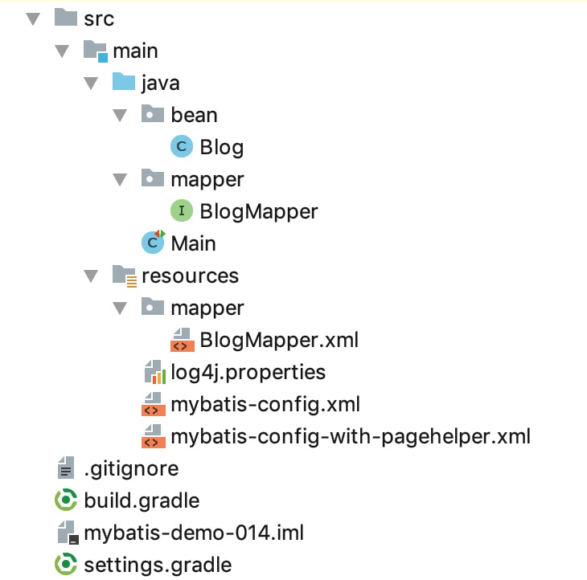

# 15. 分页查询


## 什么是分页（pagination）

例如在数据库的某个表里有1000条数据，我们每次只显示100条数据，在第1页显示第0到第99条，在第2页显示第100到199条，依次类推，这就是分页。

分页可以分为`逻辑分页`和`物理分页`。

* `逻辑分页`是我们的程序在显示每页的数据时，首先查询得到表中的1000条数据，然后成熟根据当前页的“页码”选出其中的100条数据来显示。不推荐使用。
* `物理分页`是程序先判断出该选出这1000条的第几条到第几条，然后数据库根据程序给出的信息查询出程序需要的100条返回给我们的程序。


我们以见 [01. 数据准备](01-数据准备.md) 的blog 表为例学习如何使用mybatis进行分页查询。

blog 表数据如下：

```
mysql> select * from blog;
+----+----------+---------------+--------------+
| id | owner_id | title         | content      |
+----+----------+---------------+--------------+
|  1 |        1 | 标题1         | 文本1        |
|  2 |        1 | 标题2         | 文本2        |
|  3 |        1 | 标题3         | 文本3        |
|  4 |        1 | 标题4         | 文本4        |
|  5 |        1 | 标题5         | 文本5        |
|  6 |        2 | 标题21        | 文本21       |
|  7 |        1 | 你好, World   | 你好, 😆       |
+----+----------+---------------+--------------+
```


本节示例代码在 [mybatis-demo-014](../../demo/mybatis-demo-014) 。

项目结构：




log4j.properties 中配置让 mybatis 输出执行信息。


## 示例1：在 sql 中显式使用 limit

在 BlogMapper 接口中增加方法：

```java
List<Blog> findByUserId(Long ownerId, Integer limit, Integer offset);
```

该方法作用是查询某个用户按照id升序排序的所有文章中，第limit篇开始的共offset篇博客。注意， limit 从 0 开始。

BlogMapper.xml 中的SQL 映射：

```xml
<select id="findByUserId" resultType="bean.Blog">
    SELECT
        id,
        owner_id AS ownerId,
        title,
        content
    FROM
        blog
    WHERE
        owner_id = #{param1}
    ORDER BY id ASC
    LIMIT  #{param2},  #{param3}
</select>
```

这个属于物理查询。

在 Main 类中编写示例代码：

```java
@Test
public void test_01() throws IOException {
    SqlSession sqlSession = getSqlSession();
    BlogMapper blogMapper = sqlSession.getMapper(BlogMapper.class);
    List<Blog> blogList = blogMapper.findByUserId(1L, 0, 2);
    blogList.forEach(item -> {
        log.info("blog: {}", item);
    });
}

private SqlSession getSqlSession() throws IOException {
    SqlSessionFactory sessionFactory;
    sessionFactory = new SqlSessionFactoryBuilder()
            .build(Resources.getResourceAsReader("mybatis-config.xml"));
    return sessionFactory.openSession();
}
```

执行 test_01 函数，结果为：

```plain
DEBUG [main] - Logging initialized using 'class org.apache.ibatis.logging.slf4j.Slf4jImpl' adapter.
DEBUG [main] - PooledDataSource forcefully closed/removed all connections.
DEBUG [main] - PooledDataSource forcefully closed/removed all connections.
DEBUG [main] - PooledDataSource forcefully closed/removed all connections.
DEBUG [main] - PooledDataSource forcefully closed/removed all connections.
DEBUG [main] - Opening JDBC Connection
DEBUG [main] - Created connection 1075738627.
DEBUG [main] - Setting autocommit to false on JDBC Connection [com.mysql.jdbc.JDBC4Connection@401e7803]
DEBUG [main] - ==>  Preparing: SELECT id, owner_id AS ownerId, title, content FROM blog WHERE owner_id = ? ORDER BY id ASC LIMIT ?, ? 
DEBUG [main] - ==> Parameters: 1(Long), 0(Integer), 2(Integer)
DEBUG [main] - <==      Total: 2
 INFO [main] - blog: Blog(id=1, ownerId=1, title=标题1, content=文本1)
 INFO [main] - blog: Blog(id=2, ownerId=1, title=标题2, content=文本2)
```

中间可以看到 mybatis 的执行语句和参数。最后两行是得到的查询结果。


## 示例2：使用 RowBounds 进行逻辑分页查询

mybatis 自带一个 RowBounds 类可以实现逻辑分页。

在 BlogMapper 接口中定义方法：

```java
List<Blog> findByUserIdWithRowBounds(Long ownerId, RowBounds rowBounds);
```

该方法作用是查询某个用户按照id升序排序的所有文章中，第rowBounds.getLimit()篇开始的共rowBounds.getOffset()篇博客。注意， limit 从 0 开始。mybatis 会自动识别出 RowBounds 参数。

BlogMapper.xml 中对应的 SQL 不必写 limit：

```xml
<select id="findByUserIdWithRowBounds" resultType="bean.Blog">
    SELECT
        id,
        owner_id AS ownerId,
        title,
        content
    FROM
        blog
    WHERE
        owner_id = #{param1}
    ORDER BY id ASC
</select>
```


在 Main 类中编写示例代码：

```java
@Test
public void test_02() throws IOException {
    SqlSession sqlSession = getSqlSession();
    BlogMapper blogMapper = sqlSession.getMapper(BlogMapper.class);
    List<Blog> blogList = blogMapper.findByUserIdWithRowBounds(1L, new RowBounds(0, 2));
    blogList.forEach(item -> {
        log.info("blog: {}", item);
    });
}
```


执行结果：

```plain
DEBUG [main] - Logging initialized using 'class org.apache.ibatis.logging.slf4j.Slf4jImpl' adapter.
DEBUG [main] - PooledDataSource forcefully closed/removed all connections.
DEBUG [main] - PooledDataSource forcefully closed/removed all connections.
DEBUG [main] - PooledDataSource forcefully closed/removed all connections.
DEBUG [main] - PooledDataSource forcefully closed/removed all connections.
DEBUG [main] - Opening JDBC Connection
DEBUG [main] - Created connection 1075738627.
DEBUG [main] - Setting autocommit to false on JDBC Connection [com.mysql.jdbc.JDBC4Connection@401e7803]
DEBUG [main] - ==>  Preparing: SELECT id, owner_id AS ownerId, title, content FROM blog WHERE owner_id = ? ORDER BY id ASC 
DEBUG [main] - ==> Parameters: 1(Long)
 INFO [main] - blog: Blog(id=1, ownerId=1, title=标题1, content=文本1)
 INFO [main] - blog: Blog(id=2, ownerId=1, title=标题2, content=文本2)
```


可以看到执行的 SQL 并为使用 limit ，但获取的数据只有2条。这是因为mybatis把所有符合条件的数据都取出来了，然后根据 RowBounds 对象的内容取出部分数据返回。这种`逻辑分页`很明显是有问题的，比如有10000000条数据满足条件，这么大的数据量全部从mysql取出来耗时很长，从mysql传到java程序耗时很长，java程序的内存占用也会变很高，所以不推荐这种实现。


但这种写法很方便，我们有保持这种写法，而分页查询是物理分页的方案吗？有，用mybatis的拦截器（理解为插件，可以获取要执行的sql，修改sql）。已经有人做出这样的拦截器了，我们直接拿来用。


### 示例3：使用 RowBounds + PageHelper 进行物理分页查询


PageHelper（https://github.com/pagehelper/Mybatis-PageHelper） 是一个Mybatis分页插件，特性很丰富。


在 build.gradle 中引入依赖：

```
compile group: 'com.github.pagehelper', name: 'pagehelper', version: '5.1.7'
```

新建一个 mybatis-config-with-pagehelper.xml ，内容和mybatis-config.xml 基本一样，但引入了 pagehelper 插件：

```xml
<configuration>

    <plugins>
        <plugin interceptor="com.github.pagehelper.PageInterceptor">
            <property name="rowBoundsWithCount" value="true"/>
        </plugin>
    </plugins>
    <!-- 省略展示其他配置 -->
    <!-- ... -->
</configuration>
```


在 Main 类中编写示例代码：

```java
@Test
public void test_03() throws IOException {
    SqlSession sqlSession = getSqlSessionWithPageHelperPluginInConfigXml();
    BlogMapper blogMapper = sqlSession.getMapper(BlogMapper.class);
    List<Blog> blogList = blogMapper.findByUserIdWithRowBounds(1L, new RowBounds(0, 2));
    blogList.forEach(item -> {
        log.info("blog: {}", item);
    });
}
private SqlSession getSqlSessionWithPageHelperPluginInConfigXml() throws IOException {
    SqlSessionFactory sessionFactory;
    sessionFactory = new SqlSessionFactoryBuilder()
            .build(Resources.getResourceAsReader("mybatis-config-with-pagehelper.xml"));
    return sessionFactory.openSession();
}
```

test_03 执行结果：

```plain
DEBUG [main] - Logging initialized using 'class org.apache.ibatis.logging.slf4j.Slf4jImpl' adapter.
DEBUG [main] - PooledDataSource forcefully closed/removed all connections.
DEBUG [main] - PooledDataSource forcefully closed/removed all connections.
DEBUG [main] - PooledDataSource forcefully closed/removed all connections.
DEBUG [main] - PooledDataSource forcefully closed/removed all connections.
DEBUG [main] - Created connection 323326911.
DEBUG [main] - Returned connection 323326911 to pool.
DEBUG [main] - Cache Hit Ratio [SQL_CACHE]: 0.0
DEBUG [main] - Opening JDBC Connection
DEBUG [main] - Checked out connection 323326911 from pool.
DEBUG [main] - Setting autocommit to false on JDBC Connection [com.mysql.jdbc.JDBC4Connection@134593bf]
DEBUG [main] - ==>  Preparing: SELECT count(0) FROM blog WHERE owner_id = ? 
DEBUG [main] - ==> Parameters: 1(Long)
DEBUG [main] - <==      Total: 1
DEBUG [main] - ==>  Preparing: SELECT id, owner_id AS ownerId, title, content FROM blog WHERE owner_id = ? ORDER BY id ASC LIMIT ? 
DEBUG [main] - ==> Parameters: 1(Long), 2(Integer)
DEBUG [main] - <==      Total: 2
 INFO [main] - blog: Blog(id=1, ownerId=1, title=标题1, content=文本1)
 INFO [main] - blog: Blog(id=2, ownerId=1, title=标题2, content=文本2)
```

可以看到执行的SQL语句中出现了 LIMIT 。`LIMIT 0, 2` 与 `LIMIT 2`含义是一样的。


