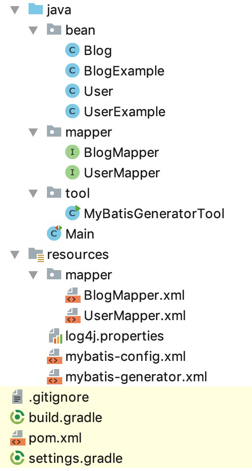

# 17. 自动生成Mapper代码和映射XML


MyBatis的映射文件和代码，写多了就腻歪了，因为变成了重复的体力活，既然是体力活，就有可能自动化实现。这个自动化实现必须有一定的抽象程度，能尽量满足所有的业务场景。


本节示例代码在 [mybatis-demo-016](../../demo/mybatis-demo-016) 。


## 数据准备

见 [01. 数据准备](01-数据准备.md)

## 项目结构

使用 IDEA 创建 gradle 项目，最终结构如下：



其中，User、UserExample、Blog、BlogExample、UserMapper、BlogMapper 类和接口是生成器生成的，UserMapper.xml、BlogMapper.xml 也是自动生成的。


## 编写生成器配置

在 resources 目录下新增 `mybatis-generator.xml` ，内容如下：

```xml
<?xml version="1.0" encoding="UTF-8"?>

<!DOCTYPE generatorConfiguration
        PUBLIC "-//mybatis.org//DTD MyBatis Generator Configuration 1.0//EN"
        "http://mybatis.org/dtd/mybatis-generator-config_1_0.dtd">

<generatorConfiguration>

    <context id="MySQLTables" targetRuntime="MyBatis3">

        <property name="javaFileEncoding" value="UTF-8"/>
        <property name="beginningDelimiter" value="`"/>
        <property name="endingDelimiter" value="`"/>

        <!--支持分页-->
        <plugin type="org.mybatis.generator.plugins.RowBoundsPlugin"/>
        <!--生成的bean支持可序列化-->
        <plugin type="org.mybatis.generator.plugins.SerializablePlugin"/>
        <!--生成的bean有hashCode实现-->
        <plugin type="org.mybatis.generator.plugins.EqualsHashCodePlugin"/>
        <!--生成的bean有toString实现-->
        <plugin type="org.mybatis.generator.plugins.ToStringPlugin"/>

        <!-- 不生成注释 -->
        <commentGenerator>
            <property name="suppressAllComments" value="true"/>
        </commentGenerator>

        <!--配置数据库-->
        <jdbcConnection driverClass="com.mysql.jdbc.Driver"
                        connectionURL="jdbc:mysql://127.0.0.1:3306/blog_db"
                        userId="root"
                        password="123456">
        </jdbcConnection>

        <javaTypeResolver >
            <property name="forceBigDecimals" value="false" />
        </javaTypeResolver>

        <!--bean类-->
        <javaModelGenerator targetPackage="bean" targetProject="src/main/java">
            <property name="enableSubPackages" value="true" />
            <property name="trimStrings" value="true" />
        </javaModelGenerator>

        <!--xml文件，注意XML是以追加的形式保存到文件中；如果要重新生成，先删除之前的-->
        <sqlMapGenerator targetPackage="mapper"  targetProject="src/main/resources">
            <property name="enableSubPackages" value="true" />
        </sqlMapGenerator>

        <!-- mapper 接口-->
        <javaClientGenerator type="XMLMAPPER" targetPackage="mapper"  targetProject="src/main/java">
            <property name="enableSubPackages" value="true" />
        </javaClientGenerator>

        <!--指定 table -->
        <table tableName="user" domainObjectName="User" modelType="flat" delimitIdentifiers="true" delimitAllColumns="true">
            <generatedKey column="id" sqlStatement="MySql" identity="true" />
        </table>
        <table tableName="blog" domainObjectName="Blog" modelType="flat" delimitIdentifiers="true" delimitAllColumns="true">
            <generatedKey column="id" sqlStatement="MySql" identity="true" />
        </table>

    </context>

</generatorConfiguration>
```


## 增加依赖

在 build.gradle 中增加：

```
compile group: 'org.mybatis.generator', name: 'mybatis-generator-core', version: '1.3.7'
```


## 生成代码和XML：方案1

编写一段java代码，执行后生成Mapper代码和文件。增加tool.MyBatisGeneratorTool 类 ，内容如下：

```java
package tool;

import org.mybatis.generator.api.MyBatisGenerator;
import org.mybatis.generator.config.Configuration;
import org.mybatis.generator.config.xml.ConfigurationParser;
import org.mybatis.generator.internal.DefaultShellCallback;

import java.io.File;
import java.util.ArrayList;
import java.util.List;

public class MyBatisGeneratorTool {

    public static void main(String[] args) throws Exception {
        List<String> warnings = new ArrayList<>();
        boolean overwrite = true;
        File configFile = new File(MyBatisGeneratorTool.class.getResource("/mybatis-generator.xml").getPath());
        ConfigurationParser cp = new ConfigurationParser(warnings);
        Configuration config = cp.parseConfiguration(configFile);

        // 虽然overwrite为true，但只针对java代码。
        // XML是以追加的形式保存到文件中；如果要重新生成，先删除之前的XML
        DefaultShellCallback callback = new DefaultShellCallback(overwrite);

        MyBatisGenerator myBatisGenerator = new MyBatisGenerator(config, callback, warnings);
        myBatisGenerator.generate(null);
    }

}
```

执行后会自动生成我们需要的代码和xml。

这种方案有两个问题：

问题1：XML是以追加的形式保存到文件中；如果要重新生成，先删除之前的XML。

问题2：如果删除了生成的mapper，而业务代码里已经引用他们了。那么在IDEA中再运行这里的代码，会因为其他代码有问题而报错。


## 生成代码和XML：方案2

该方案需要先安装maven。原理是使用生成器对应的Maven插件。

在项目根目录下增加 pom.xml ，内容如下：

```xml
<?xml version="1.0" encoding="UTF-8"?>
<project xmlns="http://maven.apache.org/POM/4.0.0"
         xmlns:xsi="http://www.w3.org/2001/XMLSchema-instance"
         xsi:schemaLocation="http://maven.apache.org/POM/4.0.0 http://maven.apache.org/xsd/maven-4.0.0.xsd">
    <modelVersion>4.0.0</modelVersion>

    <groupId>com.example</groupId>
    <artifactId>mybatis-demo</artifactId>
    <version>1.0-SNAPSHOT</version>

    <!-- 执行 `mvn mybatis-generator:generate` 命令即可 -->
    <build>
        <plugins>
            <plugin>
                <groupId>org.mybatis.generator</groupId>
                <artifactId>mybatis-generator-maven-plugin</artifactId>
                <version>1.3.7</version>
                <configuration>
                    <configurationFile>src/main/resources/mybatis-generator.xml</configurationFile>
                    <verbose>true</verbose>
                    <overwrite>true</overwrite>
                </configuration>
                <executions>
                    <execution>
                        <id>Generate MyBatis Artifacts</id>
                        <goals>
                            <goal>generate</goal>
                        </goals>
                    </execution>
                </executions>
                <!--plugin的依赖-->
                <dependencies>
                    <dependency>
                        <groupId>mysql</groupId>
                        <artifactId>mysql-connector-java</artifactId>
                        <version>5.1.46</version>
                    </dependency>
                </dependencies>
            </plugin>
        </plugins>
    </build>

    <!--代码使用的依赖-->
    <dependencies>

    </dependencies>

</project>
```

这是样板设置，`<configurationFile>src/main/resources/mybatis-generator.xml</configurationFile>`这里根据需要修改生成器配置文件位置即可，其他不需要改动。

在命令行中进入项目根目录，然后执行下面的命令：

```plain
mvn mybatis-generator:generate
```

即可生成代码和XML。

该方案仍有一个问题：XML是以追加的形式保存到文件中；如果要重新生成，先删除之前的XML。


## 生成代码和XML：方案3

使用生成器的gradle插件，并优化对应的生成器任务。

在 build.gradle 中添加：

```plain
buildscript {
    repositories {
        mavenCentral()
        maven {
            url "https://plugins.gradle.org/m2/"
        }

    }
    dependencies {
        classpath "gradle.plugin.com.thinkimi.gradle:mybatis-generator-plugin:2.0"
    }
}

apply plugin: "com.thinkimi.gradle.MybatisGenerator"

configurations {
    mybatisGenerator
}

// 执行 `gradle mbGenerator` 即可
mybatisGenerator {
    verbose = true
    configFile = 'src/main/resources/mybatis-generator.xml'
}

// 执行 mbGenerator 前先清理文件
mbGenerator.doFirst {
    delete "${rootDir}/src/main/resources/mapper/"
    println "delete mapper xml in src/main/resources/mapper/"
}
```

上面的主要部分来自：https://plugins.gradle.org/plugin/com.arenagod.gradle.MybatisGenerator 、https://github.com/kimichen13/mybatis-generator-plugin 。我额外增加了运行mbGenerator任务前自动清理文件的配置。


在命令行执行 `gradle mbGenerator` 即可。

也可以在 IDEA 中找到该任务，点击执行：


## 使用示例

在 Main 中增加：

```java
import java.io.IOException;
import java.util.HashMap;
import java.util.List;
import java.util.Map;

import bean.Blog;
import bean.BlogExample;
import lombok.Data;
import lombok.extern.slf4j.Slf4j;
import mapper.BlogMapper;
import org.apache.ibatis.io.Resources;
import org.apache.ibatis.session.RowBounds;
import org.apache.ibatis.session.SqlSession;
import org.apache.ibatis.session.SqlSessionFactory;
import org.apache.ibatis.session.SqlSessionFactoryBuilder;

import bean.User;
import mapper.UserMapper;
import org.junit.Test;

@Slf4j
public class Main {

    @Test
    public void test_01() throws IOException {
        try (SqlSession sqlSession = getSqlSession()){
            UserMapper userMapper = sqlSession.getMapper(UserMapper.class);
            BlogMapper blogMapper = sqlSession.getMapper(BlogMapper.class);

            User user = userMapper.selectByPrimaryKey(1L);
            Blog blog = blogMapper.selectByPrimaryKey(1L);
            log.info("user: {}", user);
            log.info("blog: {}", blog);
        }
    }

    @Test
    public void test_02() throws IOException {
        try (SqlSession sqlSession = getSqlSession()){
            UserMapper userMapper = sqlSession.getMapper(UserMapper.class);
            BlogMapper blogMapper = sqlSession.getMapper(BlogMapper.class);

            Blog blog = new Blog();
            blog.setOwnerId(1L);
            blog.setTitle("你好, World");
            blog.setContent("你好, 😆");

            int result = blogMapper.insertSelective(blog);
            log.info("result: {}", result);
            log.info("blog: {}", blog);
        }
    }


    @Test
    public void test_03() throws IOException {
        try (SqlSession sqlSession = getSqlSession()){
            UserMapper userMapper = sqlSession.getMapper(UserMapper.class);
            BlogMapper blogMapper = sqlSession.getMapper(BlogMapper.class);

            BlogExample blogExample = new BlogExample();
            blogExample.createCriteria().andIdBetween(1L, 4L);
            blogExample.setOrderByClause("id asc");
            // 不要用 selectByExample，用selectByExampleWithBLOBs，因为 title、content类型为text，会被当做blob。
            // List<Blog> blogList = blogMapper.selectByExample(blogExample);
            List<Blog> blogList = blogMapper.selectByExampleWithBLOBs(blogExample);
            blogList.forEach( item -> {
                log.info("blog: {}", item);
            });
        }
    }


    @Test
    public void test_04() throws IOException {
        try (SqlSession sqlSession = getSqlSession()){
            UserMapper userMapper = sqlSession.getMapper(UserMapper.class);
            BlogMapper blogMapper = sqlSession.getMapper(BlogMapper.class);

            BlogExample blogExample = new BlogExample();
            blogExample.setOrderByClause("id desc");
            RowBounds rowBounds = new RowBounds(0, 2); // offset 为0， limit 为2
            List<Blog> blogList = blogMapper.selectByExampleWithBLOBsWithRowbounds(blogExample, rowBounds);

            blogList.forEach( item -> {
                log.info("blog: {}", item);
            });
        }
    }


    /**
     * 获取 SqlSession
     */
    private SqlSession getSqlSession() throws IOException {
        SqlSessionFactory sessionFactory;
        sessionFactory = new SqlSessionFactoryBuilder()
                .build(Resources.getResourceAsReader("mybatis-config.xml"));
        return sessionFactory.openSession();
    }
}
```

这里给了4个示例。


`test_01`示例是根据id查询user和blog ，结果是：

```
 INFO [main] - user: User [Hash = -1981177266, id=1, name=letian, email=letian@111.com, password=123, serialVersionUID=1]
 INFO [main] - blog: Blog [Hash = 857656589, id=1, ownerId=1, title=标题1, content=文本1, serialVersionUID=1]
```

`test_02`示例是新增一篇博客，运行结果如下：

```
 INFO [main] - result: 1
 INFO [main] - blog: Blog [Hash = -407908845, id=8, ownerId=1, title=你好, World, content=你好, 😆, serialVersionUID=1]
```

注意，因为没有commit，所以这条数据并未真正插入数据库。

`test_03`示例是查询id在[1,4]范围的博客，按照id升序排序，运行结果是：

```
 INFO [main] - blog: Blog [Hash = 857656589, id=1, ownerId=1, title=标题1, content=文本1, serialVersionUID=1]
 INFO [main] - blog: Blog [Hash = 857686412, id=2, ownerId=1, title=标题2, content=文本2, serialVersionUID=1]
 INFO [main] - blog: Blog [Hash = 857716235, id=3, ownerId=1, title=标题3, content=文本3, serialVersionUID=1]
 INFO [main] - blog: Blog [Hash = 857746058, id=4, ownerId=1, title=标题4, content=文本4, serialVersionUID=1]
```


`test_04`示例是按照id降序获取前两篇博客，运行结果：

```
 INFO [main] - blog: Blog [Hash = -407938636, id=7, ownerId=1, title=你好, World, content=你好, 😆, serialVersionUID=1]
 INFO [main] - blog: Blog [Hash = 789074769, id=6, ownerId=2, title=标题21, content=文本21, serialVersionUID=1]
```

